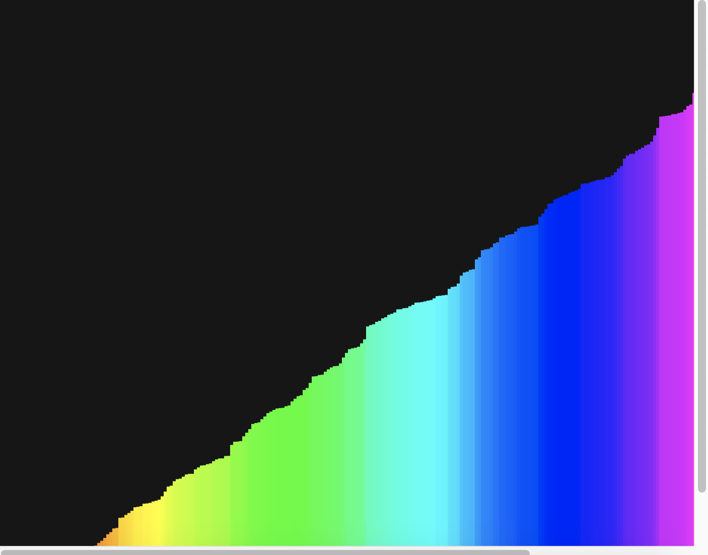
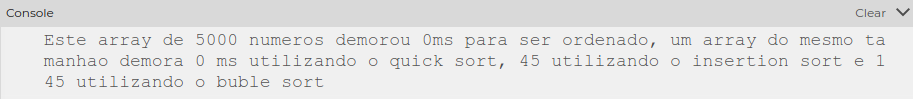

# Merge Sort

**Número da Lista**: 4
**Conteúdo da Disciplina**: Divide and Conquer

## Alunos
|Matrícula | Aluno |
| -- | -- |
| 17/0039668  |  Lucas Ganda Carvalho  |
| 17/0047326  |  Wictor Bastos Girardi |

## Sobre 
O Projeto consiste na visualização do algoritmo de Dividir para conquistar, onde durante a execução do projeto um array é ordenado de forma visual para o usuário. Alem disso o projeto tambem calcula o tempo em milissegundos(ms) que o algoritmo demorou para ser executado e mostra a media de tempo que outros algoritmos demoram para ordenar um array do mesmo tamanho.

## Screenshots

## Execução
Entre no site https://editor.p5js.org/ e copie o código fonte para a execução do projeto. O grafico sera plotado a direita e embaixo o console mostrara o tempo de execucao

